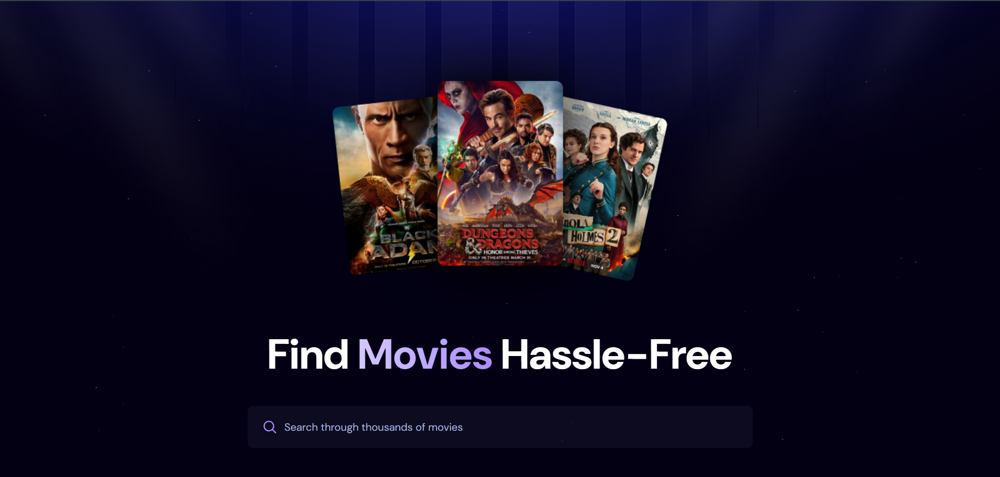
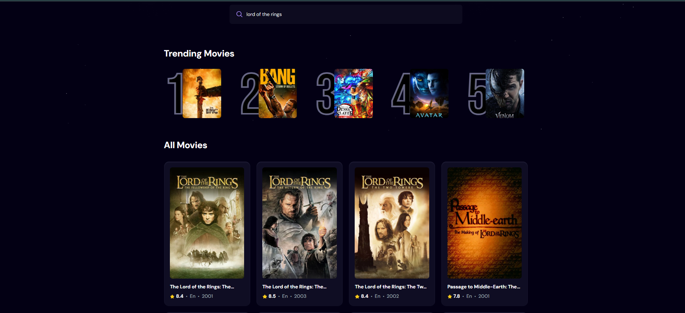
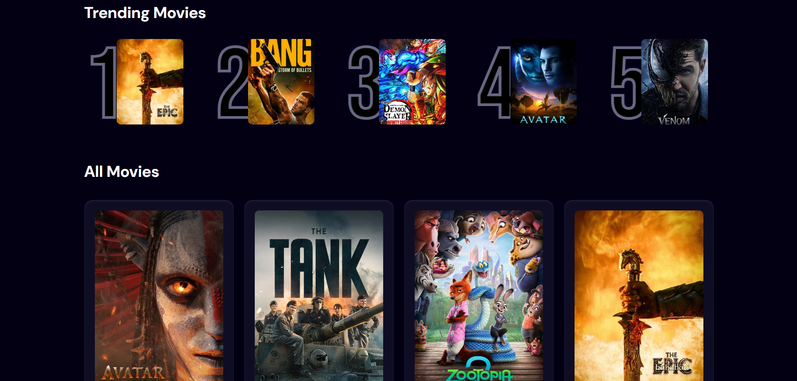

# 🎬 Movie App

A **modern Movie App** built with **React.js**, **Appwrite**, and **TailwindCSS**, designed to let users **browse movies, search for titles, and explore trending content**.  
The app features a **sleek, responsive design**, dynamic trending logic based on user searches, and smooth UI interactions powered by React and Appwrite.  

🚀 **Live Demo:** [Check it out on Netlify](https://movie-suggestion-application.netlify.app/)

---

## ⚙️ Tech Stack

- **React.js** – For building reusable UI components and managing app state efficiently.  
- **Appwrite** – Provides backend services like databases, and storage.  
- **Tailwind CSS** – Enables rapid, responsive, and modern styling.  
- **Vite** – Fast build tool for a smooth development experience.  
- **TMDB API** – Fetches real-time movie data for search and trending functionality.  

---

## 🔋 Key Features

- 🔍 **Search Movies** – Quickly find any movie by title.  
- 📈 **Trending Section** – Displays the most searched movies dynamically.  
- 🎨 **Modern UI/UX** – Clean, minimal design for an intuitive experience.  
- ⚡ **Reusable Architecture** – Modular components and hooks for scalability.  
- 🌐 **Fully Deployed** – Access the app anytime through Netlify.  

---

## 🖼 Screenshots

**Home / Browse Movies**  
  

**Search Movies**  
  

**Trending Section**  
 

---

## 💡 Highlights

- Trending logic based on **real user searches**, tracked in Appwrite.  
- Debounced search input minimizes API calls and improves performance.  
- Designed for **both desktop and mobile** with full responsiveness.  
- Demonstrates **modern React development** and backend integration with Appwrite.  

